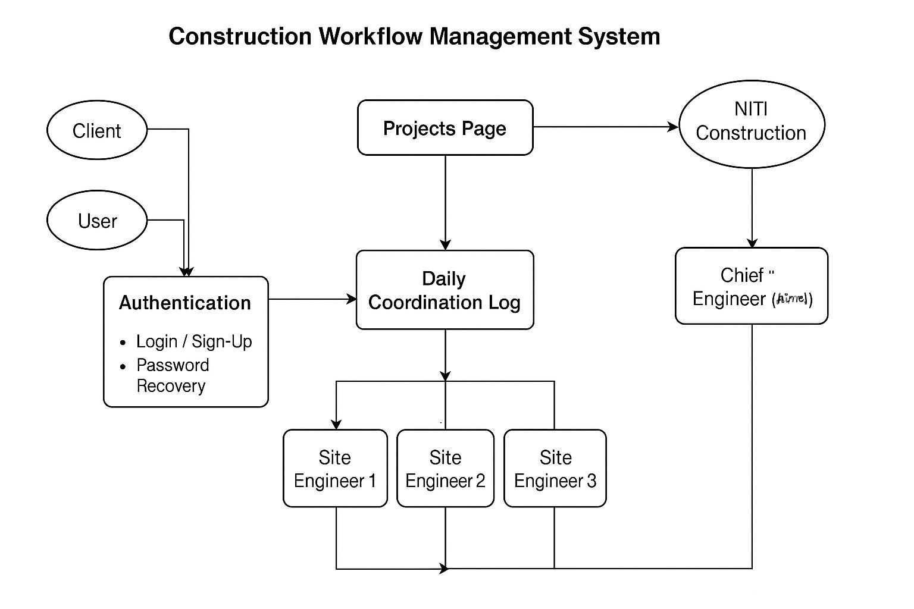
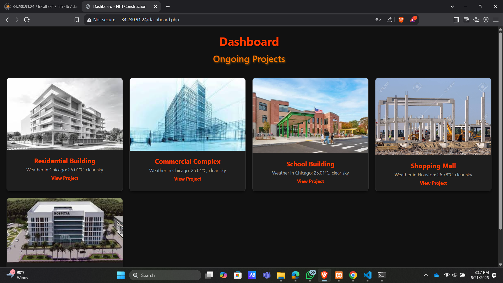
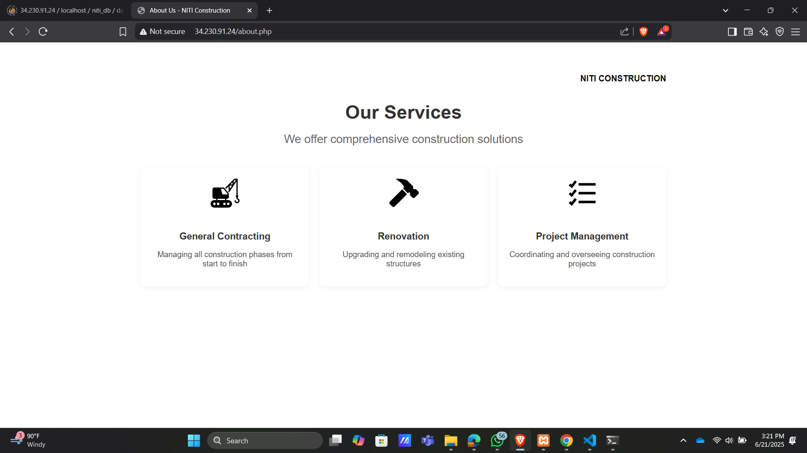
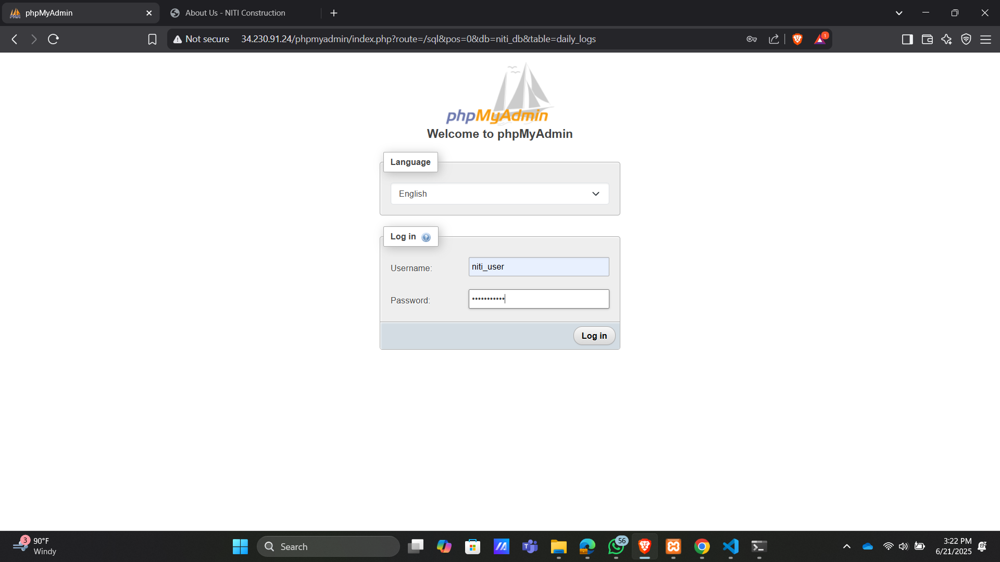
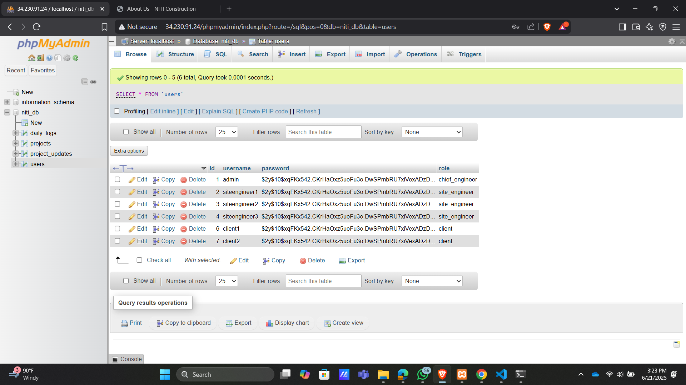
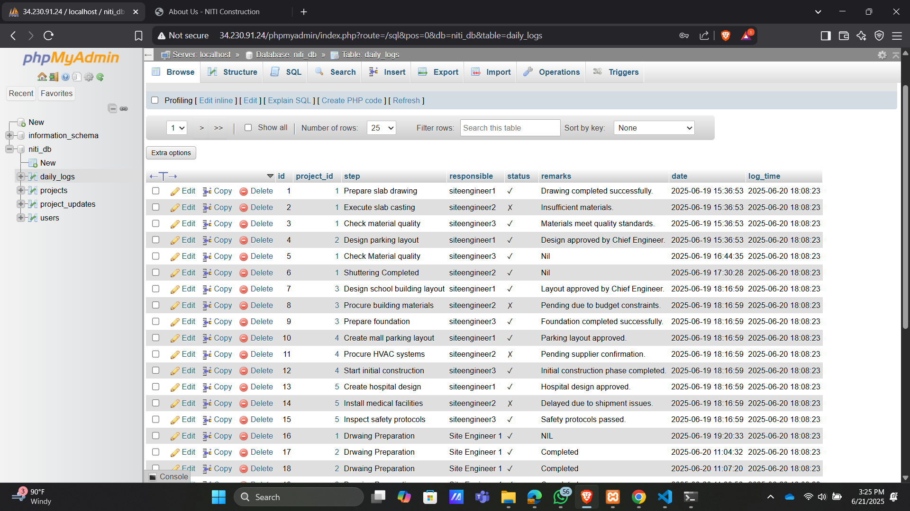
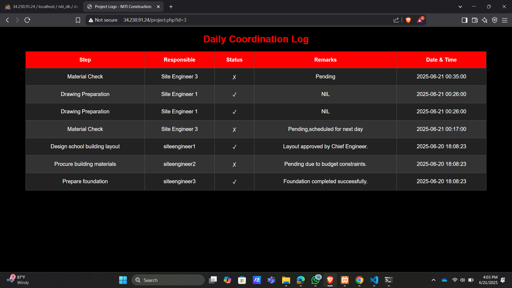
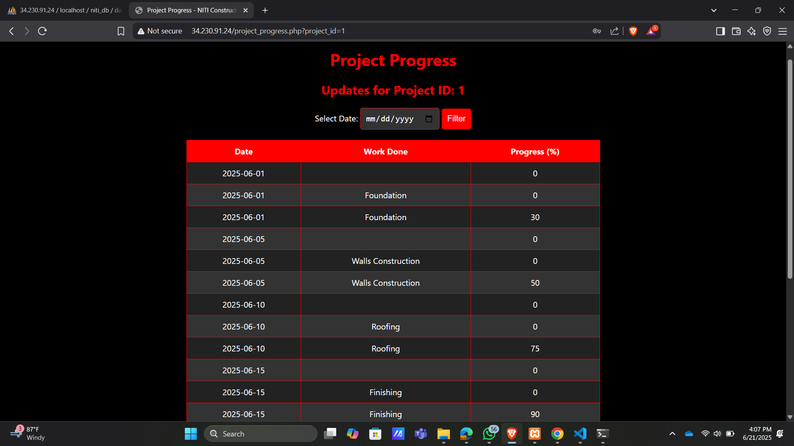
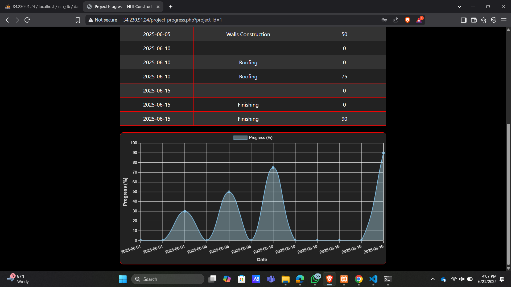

# 🏗️ NITI Construction - Project Coordination Platform

A role-based web application that simplifies construction site coordination for **Site Engineers**, **Chief Engineers**, and **Clients**. This platform helps track project progress, manage daily logs, and ensure transparent communication across stakeholders.

---

## 🌐 Deployed On

The application is currently deployed on an **AWS EC2 instance** and accessible via EC2 public IP or domain.

My ec2 public IP:http://34.230.91.24/

📦 Features

- 🧱 **Site Engineers** can submit daily work logs.
- 🧑‍💼 **Chief Engineers** review and monitor progress.
- 👷 **Clients** can view their up-to-date project information.
- 🔐 Secure login & session-based role redirection.
- 📅 Time-stamped progress records.
- 🎨 Stylish UI with responsive dashboards.

⚙️ Setup & Installation (Local or AWS)

Prerequisites

- PHP (>= 7.4)
- MySQL/MariaDB
- Apache2
- Git
- AWS EC2 

Installation Steps

1. **Clone the Repository**

   git clone https://github.com/Anusri30/niti-construction.git
   
   cd niti-construction

2. Upload files to your AWS EC2 using SCP or clone repo directly into EC2.
   
   Ensure Apache, PHP, and MySQL are installed and configured.

3. **Move Project to Web Directory**
   
   sudo mv * /var/www/html/

4. **Set File Permissions**
 
   sudo chown -R www-data:www-data /var/www/html/
   
   sudo chmod -R 755 /var/www/html/

5. **Configure Apache (if needed)**

   Ensure Apache is serving /var/www/html and restart:
   
   sudo systemctl restart apache2

6. **Create the MySQL Database**
   
   Log in to MySQL and run:
   
   CREATE DATABASE niti_construction CHARACTER SET utf8mb4 COLLATE utf8mb4_unicode_ci;
   
   CREATE USER 'niti_user'@'localhost' IDENTIFIED BY 'password123';
   
   GRANT ALL PRIVILEGES ON niti_construction.* TO 'niti_user'@'localhost';
   
   FLUSH PRIVILEGES;
   
7. **Import Tables**
   
    Import your daily_logs, users, and projects tables using:
   
    mysql -u niti_user -p niti_construction < db/schema.sql

🧪 Usage
Navigate to your EC2 public IP in a browser.

Register as a Site Engineer, Chief Engineer, or Client.

Log in and access role-specific dashboards:

Site Engineers submit logs (project.php).

Chief Engineers view all project logs.

Clients see their daily progress summaries.

🗂️ File Structure:

/var/www/html/

├── index.php              # Login Page

├── register.php           # User Registration

├── project.php            # Site Engineer Log Entry

├── client_dashboard.php   # Client View

├── styles.css             # Styling

├── success.php            # Confirmation after log

├── db/schema.sql          # SQL for DB structure

├── README.md              # You're here

🏛️ Architecture Overview:

🌍 Deployment on AWS EC2 (Amazon Linux)

The NITI Construction platform is deployed on an AWS EC2 instance running Amazon Linux 2023. The following components were configured for a production-ready environment:

🔧 EC2 Instance Configuration

OS: Amazon Linux 2023 (AMI)

Instance Type: t2.micro (or as needed)

Security Groups: Configured to allow inbound access on ports:

80 (HTTP)

22 (SSH)

Elastic IP: Attached for consistent public access.

🛠️ Software Stack Setup:
 
 1.Install Apache:
 
 sudo yum update -y
 
 sudo yum install httpd -y
 
 sudo systemctl enable httpd
 
 sudo systemctl start httpd

2.Install PHP and MySQL:

 sudo amazon-linux-extras enable php8.2
 
 sudo yum clean metadata
 
 sudo yum install php php-mysqli php-cli php-common php-pdo -y

3.Install MariaDB Server (MySQL-Compatible):

 sudo yum install mariadb105-server -y
 
 sudo systemctl start mariadb
 
 sudo systemctl enable mariadb

4.Install phpMyAdmin (Optional)

Configure Apache to serve phpMyAdmin (requires additional setup).

5.📂 Deploy Your Application

SSH into your EC2 instance and clone the repository:

 git clone https://github.com/yourusername/niti-construction.git
 
 cd niti-construction 
 
 sudo cp -r * /var/www/html/
 
 sudo systemctl restart httpd

6.git clone https://github.com/yourusername/niti-construction.git

 cd niti-construction
 
 sudo cp -r * /var/www/html/
 
 sudo systemctl restart httpd

🔒 Permissions and Security

Ensure proper permissions:

sudo chown -R apache:apache /var/www/html/

sudo chmod -R 755 /var/www/html/

Configure .env or database credentials securely in your PHP code.

🌐 Access Your Application

Open your browser and go to:

🌐 Access Your Application

Open your browser and go to:

http://34.230.91.24/
http://<your-ec2-public-ip>/

☁️ OpenWeather API Integration:

The platform integrates the OpenWeather API to fetch real-time weather data for project sites. This enhances situational awareness for engineers and clients during daily log submissions.

Usage

API Key is securely stored in a configuration file.

Data such as temperature, humidity, and weather conditions is displayed on the dashboard.

You can replace the demo key in weather.php with your own API key.

MY APPLICATION DEPLOYED IN AWS USING EC2:

Developed by Anusri C
📧 anusri1771@gmail.com
🔗 https://github.com/Anusri30
